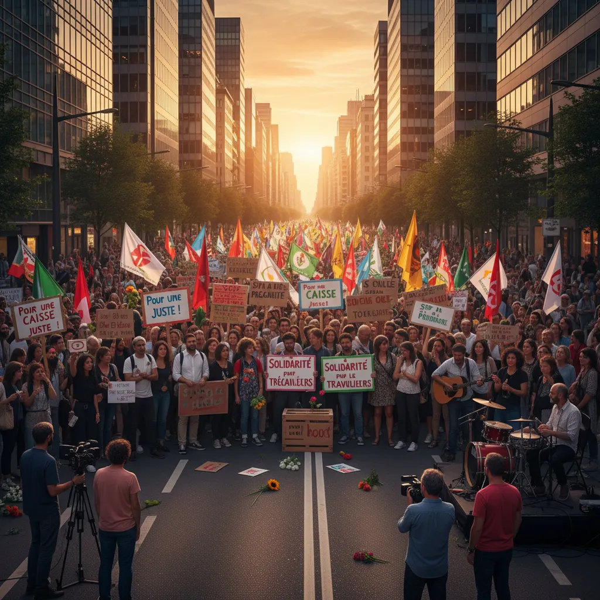

# CAISSE :  Manif 10 septembre 🗓️ 👉  Tout savoir !  

<h1>Manifestation des Caisses du 10 septembre 🧮✊</h1>

<ul>
  <li>
    <h2>Un mouvement citoyen pour une justice financière 💪</h2> 
    
Le 10 septembre, des citoyens de partout au 🇨🇦 se sont rassemblés pour une manifestation majeure visant à dénoncer l'injustice financière causée par les systèmes de caisses.

    
Les participants ont exprimé leur frustration face aux : 

    <ul>
      <li>taux d'intérêts exorbitants 💸</li>
      <li>frais abusifs 🚫+</li>
      <li>manque de transparence dans les pratiques  shrouded in secrecy 🪗</li>
    </ul>
  </li>
  <li>
    <h2>Des revendications claires et déterminées ✊</h2>
    
Les manifestants ont exprimé l'espoir de voir : 

    <ul>
      <li>une réforme des systèmes de caisses pour les rendre plus équitables 🌈</li>
      <li>une meilleure protection des consommateurs 🧑‍🤝‍🧑</li>
      <li>un accès plus équitable au financement pour tous 👥</li>
    </ul>
  </li>
  <li>
    <h2>L'importance d'une mobilisation citoyenne 🌎</h2>
    
Cette manifestation a démontré la force du mouvement citoyen et l'importance de se mobiliser pour faire entendre sa voix face aux injustices financières. 📣

    
La poursuite des discussions et des actions citoyennes est essentielle pour parvenir à des changements concrets.

  </li>
</ul>

        