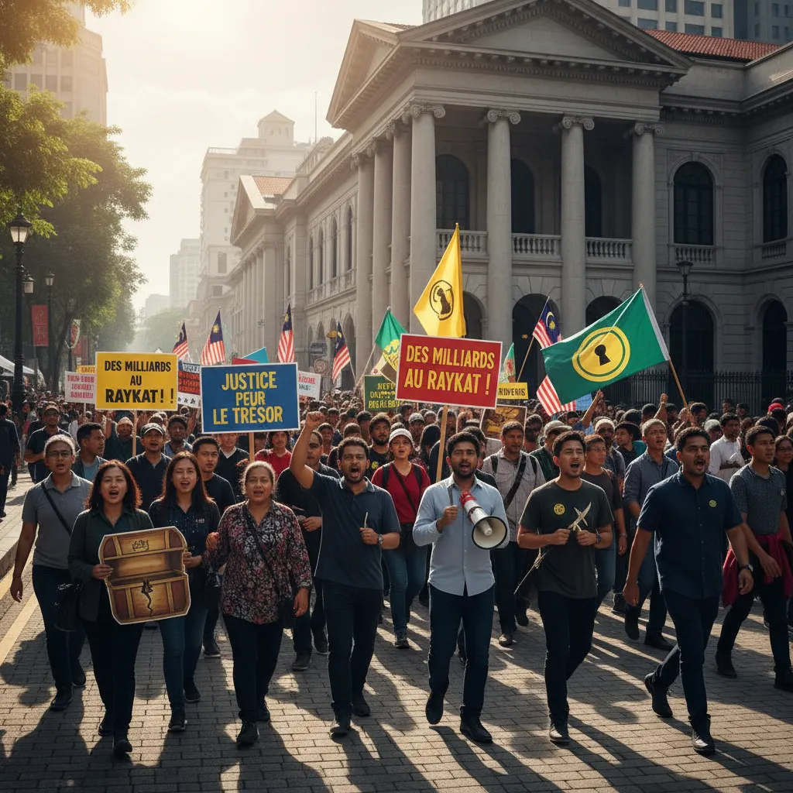

# 10 septembre : La Trésorerie Sous les projecteurs 💰  




```html
<h2>Manifestation 10 Septembre : Trésor  descubrir les richesses ! 💎</h2>
<ol>
  <li>
    <h3>Une journée d'action solidaire🌱</h3>
    <p>Le 10 septembre, une importante manifestation  sera organisée afin de mobiliser le peuple autour d'une cause urgente : la protection des trésors  de notre planète. 🌍</p>
  </li>
  <li>
    <h3>Un appel à la conscience collective 💪</h3>
    <p>L'objectif de cette manifestation est de sensibiliser les citoyens aux enjeux écologiques et de promouvoir un avenir durable pour tous. 🌻</p>
  </li>
  <li>
    <h3>Découvrir les richesses cachées 🔎</h3>
    <p>Au programme de la journée : des ateliers éducatifs, des concerts plein air, des expositions sur les énergies renouvelables et bien plus encore. 🎨🎶💡</p> 
  </li>
  <li>
    <h3>Unis pour un avenir meilleur🤝</h3>
    <p>Ensemble, rejoignons cette manifestation et partageons un message fort : nous avons la capacité d'investir dans un avenir plus vert et plus prospère. 🌈</p> 
  </li>
</ol>
  <p> Rendez-vous le 10 septembre pour un événement plein d'espoir et de positif énergétique ! 🤩 </p>


```

## Astuces supplémentaires : 

* Vous pouvez ajouter des informations spécifiques sur le lieu et l'heure de la manifestation.
* Incluez des liens vers les réseaux sociaux et les pages web dédiés à l'événement.
* Utilisez des images et des vidéos pour rendre votre article plus attractif.


        