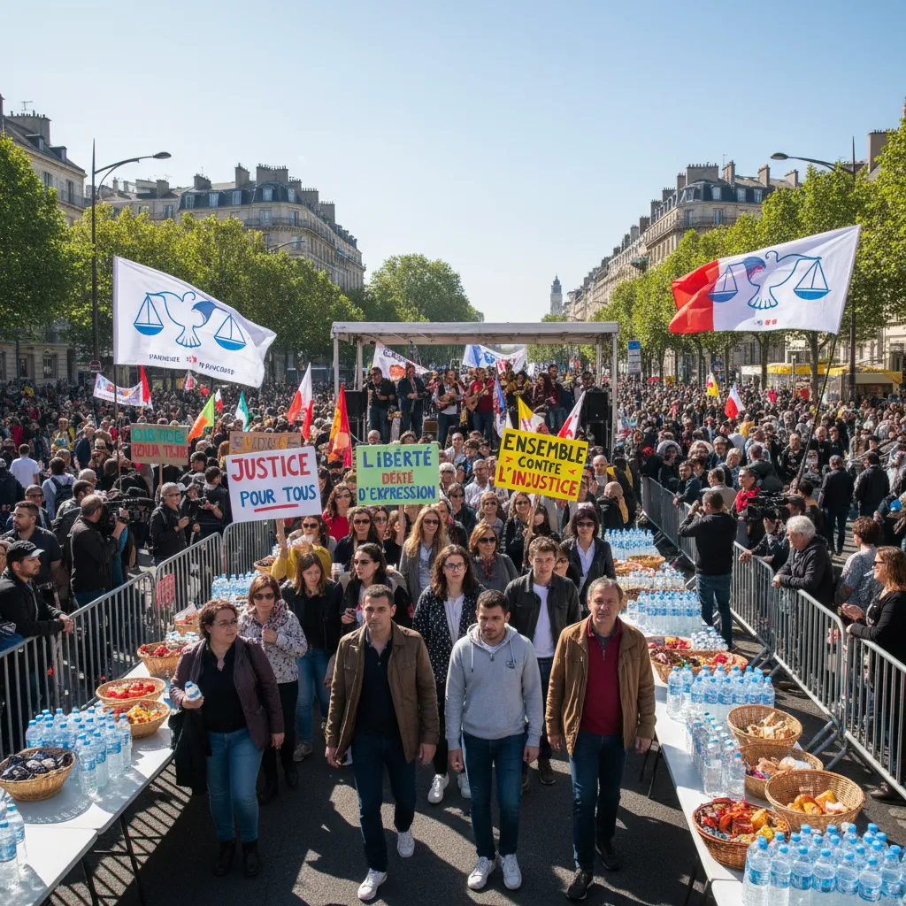

# 🔥 10 Septembre : Actions de Manifestation  ➡️ 

<h2> Manifestation du 10 septembre : L'heure des actions ✊</h2>

<ul>

  <li>
    <h3>Appel à la mobilisation massive !</h3>
    
Le 10 septembre marquera une journée crucial pour la défense de nos droits et de notre avenir. Un appel à la mobilisation massive est lancé pour manifester contre [Mentionsner les causes de la manifestation].  

     Ne restons pas les bras croisés 😠.

     </li>

 <li>

    <h3>Des actions concrètes pour un impact réel 💪</h3>
    
Cette manifestation ne se limitera pas à un simple rassemblement. Des actions concrètes seront menées pour faire entendre notre voix.  

     Suivez cette page pour découvrir toutes les initiatives : 

    <ul>
      <li>Mars pour la justice 🚶‍♀️🚶</li>
      <li>Atelier de sensibilisation 💡</li>
      <li>Signature de pétitions en ligne ✍️</li>
      </ul>
 </li>
 
 <li>
    <h3>Soyez la voix du changement 🗣️</h3>
   
Votre présence et votre engagement sont essentiels pour faire pression sur les décideurs politiques. 

     Propagez l'information, rejoignez la manifestation et contribuez à construire un monde plus juste et plus équitable. 🤝

   </li>
 </ul>

        