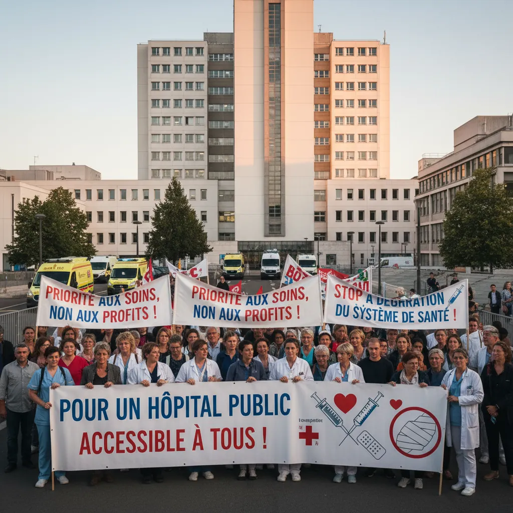

# Manifestations & Santé : hôpitaux à l'épreuve ⚕️  

<h1>Manifestation du 10 septembre et Fonction publique santé-hôpital 🩺🏥✊</h1>

<ul>
  <li>
    <h2>Contexte 🌍</h2>
    
Le 10 septembre dernier, une manifestation importante s'est tenue dans tout le pays au service des professionnels de santé et des personnels hospitaliers 👨‍⚕️👩‍⚕️. Cette manifestation s'inscrit dans un contexte plus large de revendications concernant les conditions de travail et les salaires dans le secteur de santé. 📈

  </li>
  <li>
    <h2>Organismes impliqués 👥</h2>
    
La manifestation a été organisée par plusieurs organisations syndicales, notamment ceux représentant les personnels soignants, paramédicaux, et administratifs.

  </li>
  <li>
    <h2>Principales revendications 📣</h2>
    
Les manifestants ont réclamé notamment:

    <ul>
      <li>Une hausse significative des salaires</li>
      <li>L'amélioration des conditions de travail</li>
      <li>Des investissements accrus dans le système de santé</li>
      <li>La mise en place d'un plan de prévention des violences envers le personnel hospitalier</li>
    </ul>
  </li>
  <li>
    <h2>Impact sur le système de santé 🤔</h2>
    
La manifestation a eu un impact certain sur le fonctionnement du système de santé, avec des perturbations dans le fonctionnement de certains hôpitaux et services de santé. 🚑

  </li>
  <li>
    <h2>Perspectives 🔮</h2>
    
La mobilisation des personnels de santé se poursuit, avec de nouvelles actions envisagées si les revendications ne sont pas prises en compte. ⏳

  </li>
</ul>

        