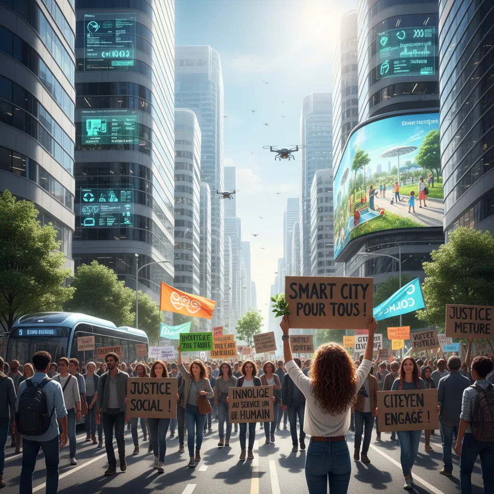

# Ville intelligente : La manif du 10 septembre 🏙️  

<h1>Manifestation du 10 Septembre et Ville Intelligente 🏙️ : Une OPPORTUNITE D'INNOVATION 💡</h1>

<ul>
  <li>
    <h2>Une ville intelligente : pas juste des gadgets 📵</h2>
    
La "ville intelligente" est bien plus que des applications mobiles ou des lampadaires connectés. C'est une vision de  villes plus durables, plus inclusives et plus résilientes grâce à des technologies intelligentes. 🌎🤝💪

  </li>
  <li>
    <h2>La manifestation du 10 Septembre : Une voix pour la changement 🗣️</h2>
    
Le 10 Septembre, des citoyens de partout se mobilisent pour réclamer des changements concrets concernant l'avenir de nos villes. C'est une occasion unique d'engager la discussion sur la définition d'une ville intelligente qui répond aux besoins 👪 et aux aspirations de tous 🌈.

  </li>
  <li>
    <h2>L'innovation comme solution 🧰</h2>
    
La technologie peut jouer un rôle clé dans la création de villes plus justes et plus durables. Smart city solutions  peuvent améliorer la gestion des ressources , la mobilité, la sécurité publique et la qualité de vie. 💧🚗🔒🌱.

  </li>
  <li>
    <h2>Transparency et participation citoyenne 🙋‍♀️🙋‍♂️</h2>
    
Pour que la ville intelligente soit réellement réussite, il est essentiel de garantir la transparence des données, la protection de la vie privée et la participation active des citoyens. 🕵️‍♀️🔒👥.

  </li>
  <li>
    <h2>Un avenir collaboratif 🤝</h2>
    
La manifestation du 10 Septembre est un appel à l'action.  C'est le moment de faire entendre notre voix et de travailler ensemble pour construire des villes intelligentes dont nous pouvons être fiers. 🤩🎉

  </li>
</ul>

        