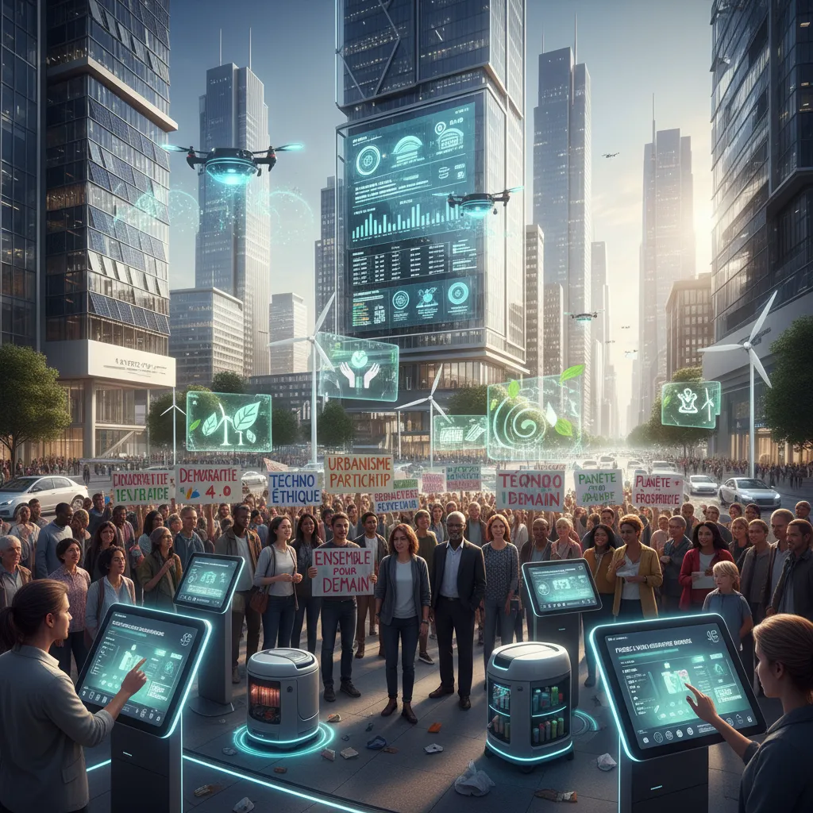

# Ville Intelligente 🧠: Manifestation #10septembre  

  <title>Manifestation du 10 septembre et Ville Intelligente 🤔🏙️  </title>

<h1>Manifestation du 10 septembre et Ville Intelligente 🤔🏙️</h1>

La manifestation du 10 septembre dernier a soulevé de nombreuses questions sur le rôle de la technologie dans la société, notamment en ce qui concerne les villes intelligentes. 💻  

<ul>
  <li>
    <h2>La sécurité et le contrôle 🔐</h2>
    
L'utilisation de la technologie de surveillance dans le cadre d'une ville intelligente soulève des inquiétudes quant à la protection de la vie privée et la liberté individuelle.     La question est de savoir si ces technologies sont utilisées de manière éthique et transparente. 

  </li>
  <li>
    <h2>L'accessibilité pour tous ♿️📈</h2>
    
Il est essentiel que les villes intelligentes profitent à tous les citoyens, quels que soient leur niveau de revenus ou leur situation sociale.    L'accès à l'information, aux services publics et aux opportunités économiques doit être équitable pour tous. 

  </li>
  <li>
    <h2>La participation citoyenne 🗣️🗳️</h2>
    
Développer des villes intelligentes doit impliquer une consultation et une participation citoyenne active.    Les citoyens doivent avoir leur mot à dire sur la façon dont la technologie est déployée dans leur environnement.

  </li>
  <li>
    <h2>L'impact environnemental 🌿♻️</h2>
    
Les villes intelligentes peuvent contribuer à réduire l'empreinte environnementale des villes, mais il est important de prendre en compte l'impact de la production et du recyclage des technologies utilisées.     La durabilité doit être une priorité.

  </li>
</ul>

 La manifestation du 10 septembre a ouvert un dialogue important sur ces questions cruciales.  Il est essentiel de continuer à discuter de l'avenir des villes intelligentes et de veiller à ce qu'elles restent des lieux inclusifs, justes et durables pour tous. 👍

        