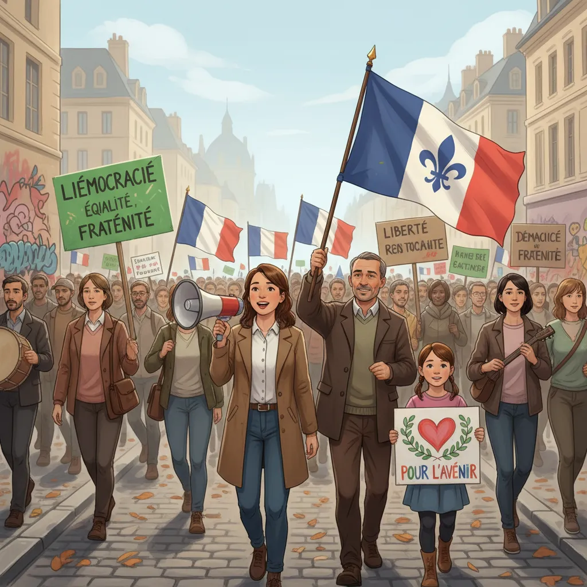

# 10 Septembre : Marche pour la démocratie ✊  

<h1> Manifestation du 10 septembre: Un cri pour la démocratie ✊🇫🇷</h1>

<ul>

  <li>

    <h2>Un jour de mobilisation citoyenne 📢 </h2>
    
Le 10 septembre a vu les citoyens français s'exprimer massivement, manifestant pour défendre la démocratie et s'opposer à la réforme des retraites qui est perçue comme injuste par une large partie de la population.  Des centaines de milliers de personnes ont défilé dans les rues des villes, exprimant leur colère et leur détermination.

  </li>

  <li>

    <h2>Des revendications légitimes ⚖️</h2>
    
Les manifestants dénoncent non seulement la réforme des retraites en elle-même, mais aussi la manière dont elle a été menée&nbsp;: sans véritable débat public et avec un mépris apparent pour les avis des Français. Ils réclament un système de retraites juste et équitable, ainsi que la restauration de la confiance entre les citoyens et leurs représentants.

  </li>

  <li>

    <h2>Le cœur de la démocratie : la liberté d'expression 🎤</h2>
    
Ce jour d'action témoigne de la vitalité de la démocratie française. Le droit de manifester pacifiquement et de se faire entendre est un pilier essentiel de la République. La force de cette mobilisation vient de la conviction profonde des citoyens que leur voix compte et qu’ils ont le droit de participer aux décisions qui les concernent.

  </li>

</ul>

        