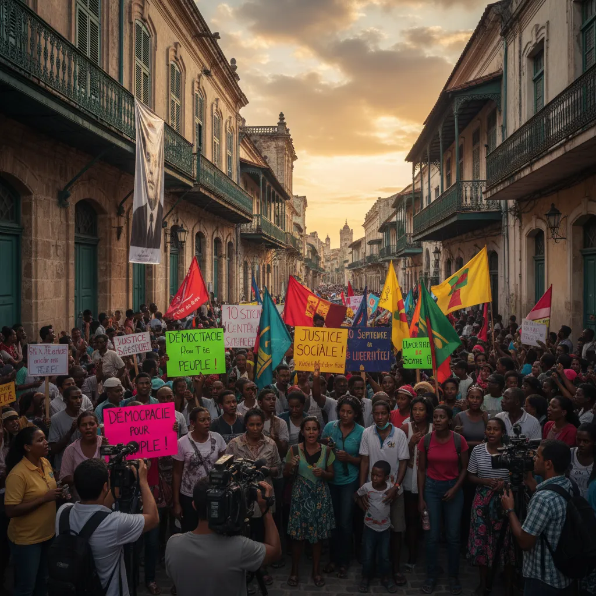

# 10 septembre : Pour une démocratie 💪 | 

<h1>Manifestation du 10 septembre et démocratie : un dialogue nécessaire 📢</h1>

<ul>
  <li>
    <h2>Le 10 septembre marque une journée importante 📅 pour la démocratie en [Nom du pays] 🇫🇷 ou [Nom du pays], où des milliers de citoyens ont manifesté pour exprimer leur désaccord avec [Brève description du sujet de la manifestation]. </h2> 
    
Ces rassemblements populaires témoignent de la vitalité démocratique indéniable de notre société. 💪 Le droit de manifester est un pilier fondamental de toute démocratie libre et responsable, et il est essentiel de laisser les citoyens exprimer librement leur opinion sans crainte de représailles. ✊

  </li>
  
  <li>
    <h2>L'engagement citoyen, moteur du progrès 🌱</h2> 
    
La manifestation du 10 septembre illustre le pouvoir du dialogue démocratique. 💬 Même si les opinions divergent sur les enjeux nationaux, il est crucial de maintenir un espace de débat ouvert et respectueux. Les manifestants ont exprimé leur volonté de participer au débat politique et de contribuer à la construction d'un avenir meilleur. 🌈

  </li>
  
  <li>
    <h2>Le rôle des institutions face aux contestations 🏛️</h2> 
    
Les autorités doivent répondre à ces manifestations de manière constructive et responsable. 🤝 Le dialogue apaisé et le respect des droits fondamentaux des citoyens sont des éléments essentiels pour une démocratie solide. 👍 Il est important d'écouter les préoccupations des manifestants et de chercher des solutions ensemble. 🤔

  </li>
</ul>

        