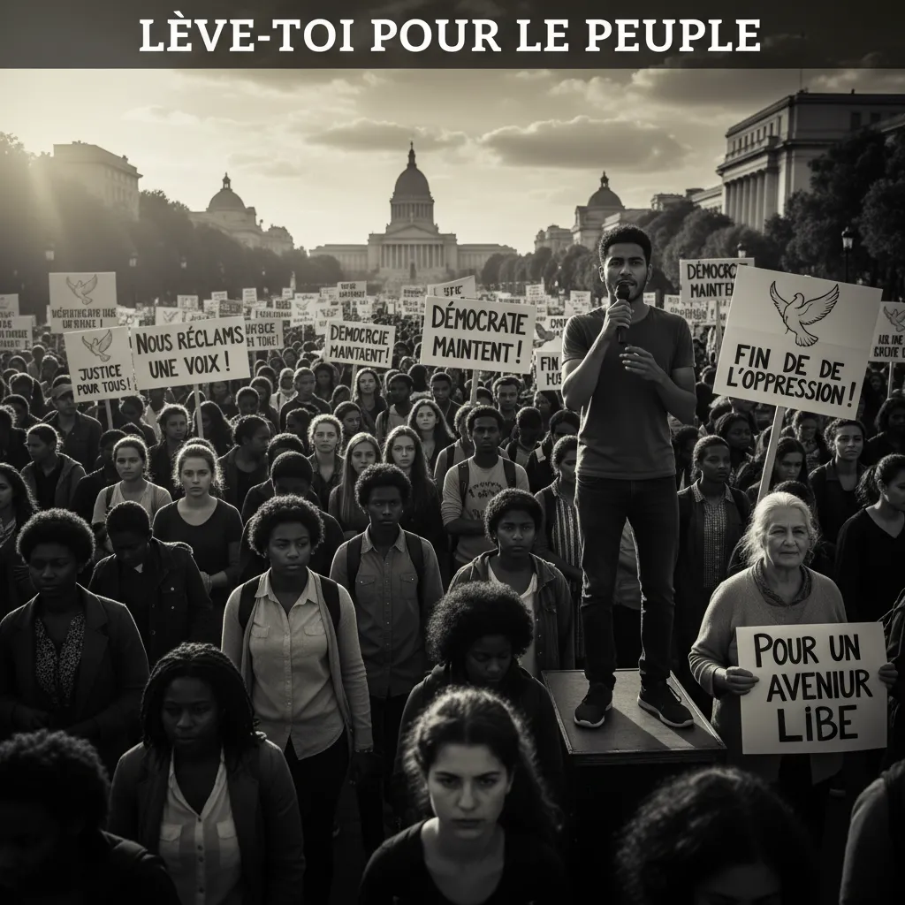

# 10/09 : Démocratie directe 🔥 ou mascarade ?  

## Manifestation 10 Septembre et Démocratie ✊🇫🇷 

Voici quelques réflexions à propos de la manifestation du 10 septembre et de son impact sur la démocratie en France :

<ul>
  <li>
    <h3>Mobilisation populaire 📈 </h3>
    La forte participation à la manifestation du 10 septembre témoigne d'une réelle mobilisation citoyenne autour de questions essentielles : réforme des retraites, cost of living, justice sociale 😫, etc. 
    Le droit de manifester est un pilier fondamental de la démocratie et cette participation est un signe vivant de son dynamisme.
  </li>
  <li>
    <h3>Pluralité des voix🗣️</h3>
    La manifestation du 10 septembre a rassemblé un large éventail de syndicats, d'associations et de citoyens issus de différents horizons. Cette diversité d'opinions et de revendications montre la richesse et la complexité du débat démocratique français.
  </li>
  <li>
    <h3>Dialogue et  débat 📢</h3>
    L'expression publique des opinions et des revendications est un élément crucial du processus démocratique.  Il est essentiel que les pouvoirs publics écoutent attentivement les voix des citoyens et soient prêts à dialoguer de manière constructive. 🤝
  </li>
  <li>
    <h3>Espaces publics  🫂</h3>
    Les manifestations offrent également un espace de rencontre et de partage entre citoyens, favorisant la cohésion sociale et la construction d'une identité collective.
  </li>
  <li>
    <h3>Responsabilités citoyennes  ⚖️</h3>
    Alors que le droit de manifester est essentiel, il est important de s'assurer que cette expression se déroule de manière pacifique et respectueuse. 🕊️ La responsabilité de chaque citoyen est de garantir que la manifestation reste un symbole positif de la démocratie.
  </li>
</ul>

&gt;
        