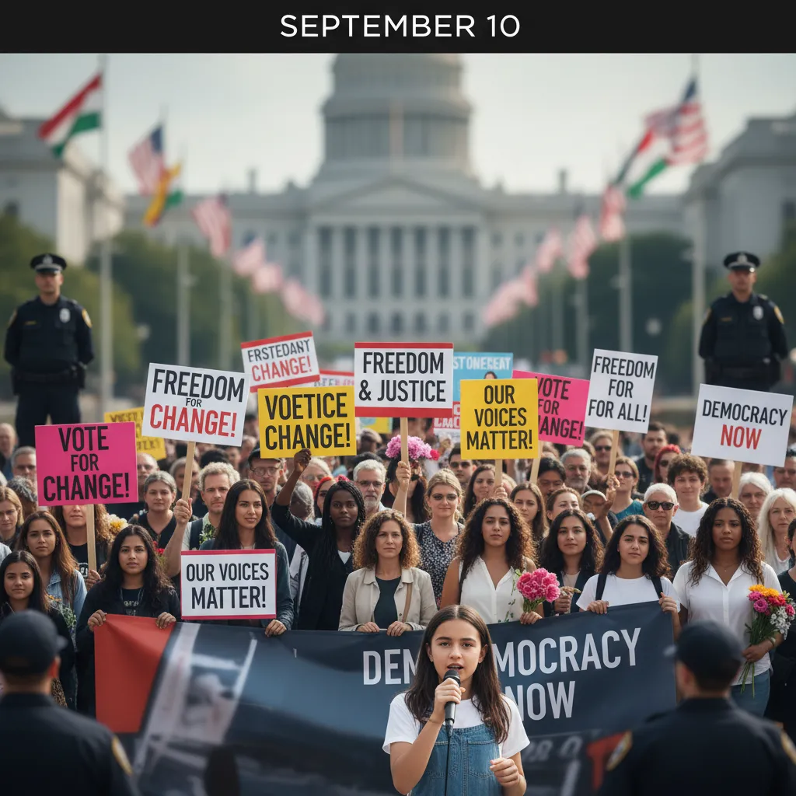

# 10 septembre : Pour une démocratie ✊  

<h1>Manifestation du 10 septembre et démocratie 🇫🇷✊

 Le 10 septembre dernier, des milliers de citoyens français se sont mobilisés pour exprimer leur mécontentement envers la réforme des retraites et défendre les principes démocratiques. ✨  Cette manifestation majeure soulève des questions importantes sur l'état de la démocratie en France et son fonctionnement.  

<ol>
<li>
  <h2>Le droit de manifester : un pilier de la démocratie ✊️ </h2>
  
Le droit de manifester pacifiquement est un droit fondamental garanti par la Déclaration Universelle des Droits de l'Homme et par la Constitution française.  Le 10 septembre, ce droit a été exercé en pleine mesure,  rassemblant des citoyens provenant de tous les horizons et exprimant leur opposition à une réforme qui touche directement leurs vies. 🗣️

</li>
<li>
  <h2>La nécessité du dialogue et de l'écoute dans une démocratie 👂</h2>
  
La manifestation du 10 septembre a démontré l'importance du dialogue et de l'écoute dans un système démocratique fonctionnel.  Le gouvernement doit prendre en compte les revendications et les préoccupations des citoyens,  et engager des discussions constructives pour trouver des solutions acceptables pour tous. 🤝

</li>
<li>
  <h2>La participation citoyenne : un moteur de démocratie 🗳️</h2>
  
La forte participation citoyenne lors de cette manifestation souligne l'engagement des Françaises et des Français envers leur démocratie. Cette mobilisation citoyenne est essentielle pour la bonne santé du système démocratique et permet aux gouvernements d'être plus représentatifs des aspirations de la population. 🌈

</li>
</ol> 

La manifestation du 10 septembre est un rappel important de la force et de la nécessité de la démocratie en France. Le droit de manifester, le dialogue, et la participation citoyenne sont des éléments essentiels pour un système démocratique solide et vibrant. ✊🕊 

</h1>
        