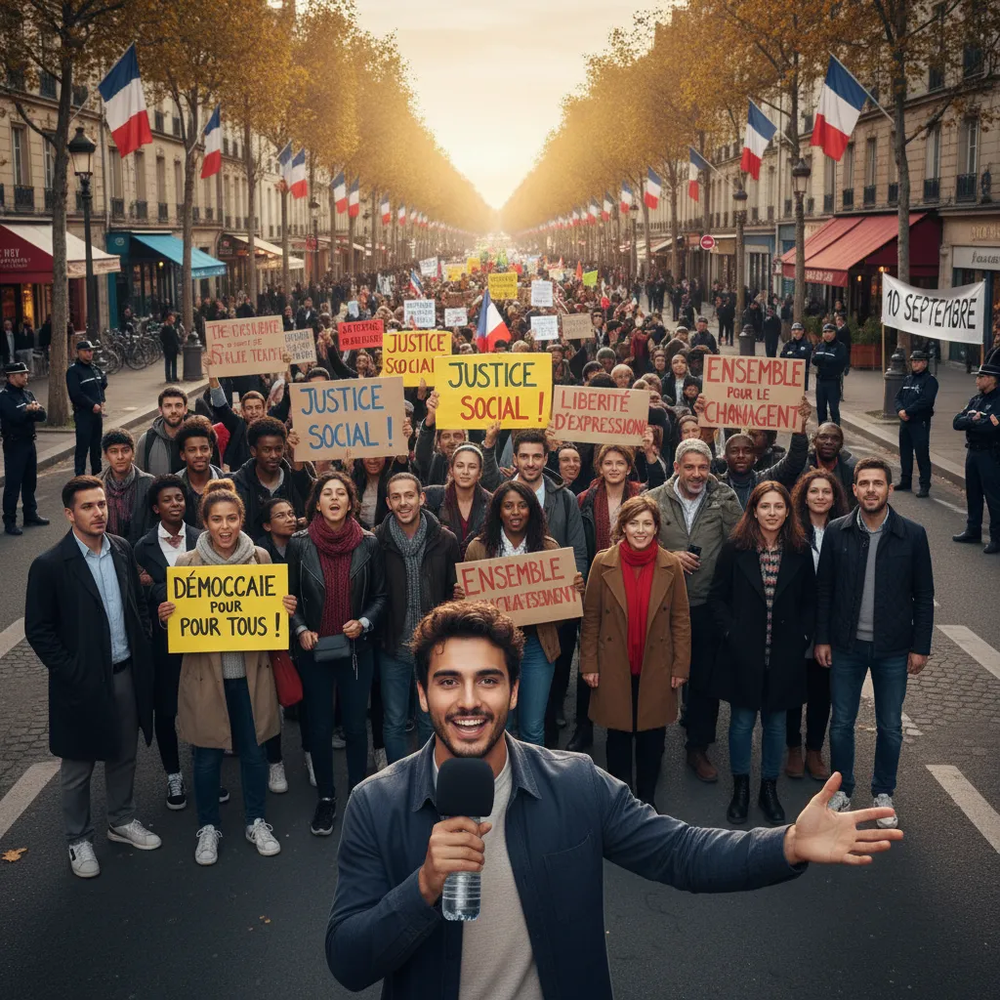

# 10 septembre : La manifestation et la démocratie ✊ 

 
 
   <title>Manifestation du 10 septembre et démocratie 🇫🇷</title> 
 
 

  <h1>Manifestation du 10 septembre et la démocratie ✊ </h1>

  
Le 10 septembre dernier, de nombreuses personnes ont manifesté dans toute la France 🇫🇷 pour exprimer leur désaccord avec certaines mesures gouvernementales. Ces manifestations, parfois houleuses, soulèvent des questions importantes sur l'état de la démocratie en France. ⚖️

 <h2>Voici quelques points importants à considérer :</h2>
 <ul>
  <li>
   
<strong>Droit à la manifestation :</strong> Le droit à la manifestation pacifique est un pilier fondamental de la démocratie. 🕊️ Il permet aux citoyens de s'exprimer librement et de faire entendre leurs voix face à leurs gouvernements. Nous devons garantir ce droit à tout citoyen de manière absolue. 

  </li>
  <li>
   
<strong>Importance du débat démocratique :</strong> Les manifestations doivent être suivies d'un dialogue constructif entre les citoyens et leurs représentants. 🗣️ Il est essentiel de créer un espace d'échanges où les différentes opinions peuvent être exprimées et débattues de manière sereine. 

  </li>
  <li>
   
<strong>Police et sécurité :</strong> La police doit garantir le maintien de l'ordre et la sécurité de tous lors des manifestations. 🚓 Il est important de trouver un équilibre entre la protection du public et le respect des libertés individuelles. 

  </li>
  <li>
   
<strong>Responsabilités des médias :</strong> Les médias ont un rôle crucial dans le processus démocratique. 📰  Ils doivent couvrir les manifestations de manière objective et impartiale, sans diffuser de contenu susceptible d'inciter à la violence. 

  </li>
 </ul>

 
La manifestation du 10 septembre est un exemple important de l'importance de la démocratie en France.  Il nous rappelle que la liberté d'expression et la possibilité de se rassembler pacifiquement sont des droits fondamentaux qui doivent être protégés. 🔱

 

        