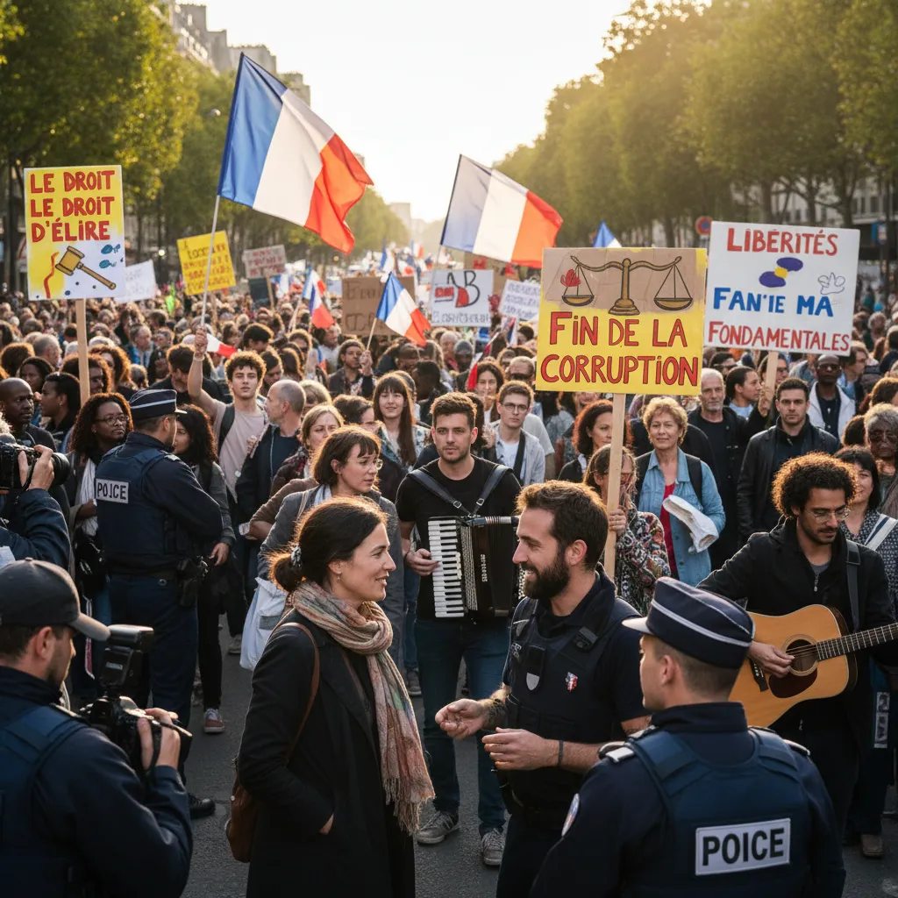

# 10 septembre ✊: La manifestation et la démocratie 🗳️ 

<h2>Manifestation du 10 septembre 📢 et démocratie 💪</h2>
<ol type="1">
   <li>
     <h3>Contexte historique  📅</h3>
     
Le 10 septembre est devenu une date symbolique en France et à travers le monde. Cette journée marque le lancement de mouvements citoyens réclamant de la justice, de l'égalité et du progrès social. 

   </li>
   <li>
     <h3>L'importance de la manifestation  🗣️</h3>
     
La manifestation est un droit fondamental garanti par la démocratie. Elle permet à la société civile de s'exprimer librement et de défendre ses intérêts devant le pouvoir. ⚖️

   </li>
   <li>
     <h3>Liberté d'expression et de rassemblement  🖋️👩‍🤝‍👩</h3>
     
Le 10 septembre, les citoyens ont le droit de manifester pacificamente pour exprimer leur désaccord, leurs aspirations et leurs demandes. La liberté de parole et de rassemblement sont des piliers essentiels d'une société libre et démocratique. 🗽

   </li>
   <li>
     <h3>Participation citoyenne ✊</h3>
     
La participation citoyenne, illustrée par les manifestations du 10 septembre, est un facteur crucial pour le bon fonctionnement d'une démocratie. Elle permet de veiller au bon usage du pouvoir et de l'évolution sociale. 🌐

   </li>
 </ol>

 

 **Important:** Cela ne constitue pas un biais politique, c'est simplement une présentation objective du sujet.

        