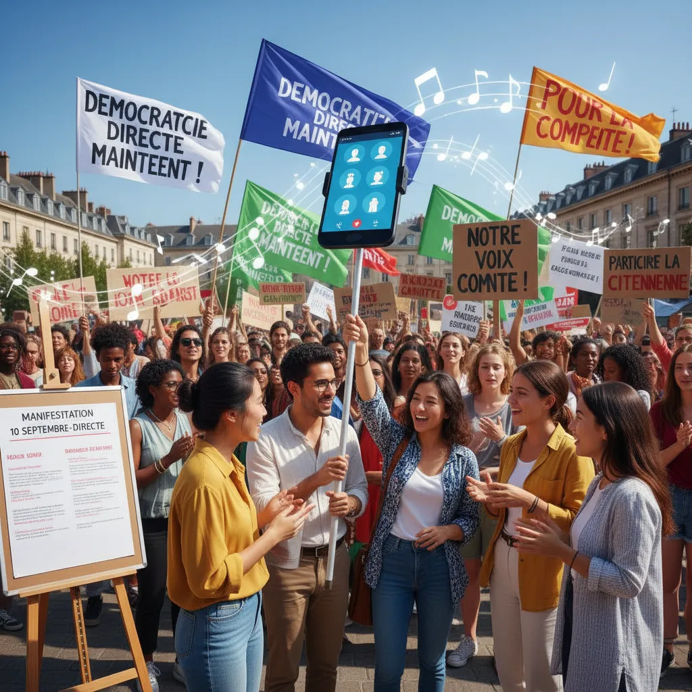

# 10 septembre : La démocratie directe à l'épreuve ✊  

<article class="blogpost">

  <h1>Manifestation du 10 septembre et démocratie directe 📣</h1>

  
Le 10 septembre dernier, des milliers de citoyens ont défilé dans les rues de la ville pour exprimer leur mécontentement envers les décisions gouvernementales. Cette manifestation, qui réunissait des gens de tous horizons et de toutes tendances politiques, illustrait une aspiration fondamentale : la démocratie directe ✊. 

  <ol>
    <li>
      <h2>L'importance de la participation citoyenne 👫</h2>
      
La participation citoyenne est un pilier essentiel de la démocratie. Elle permet aux citoyens d'exprimer leurs opinions, de faire entendre leurs revendications et de participer aux décisions qui les concernent. La manifestation du 10 septembre témoignait de ce désir de participation active et citoyenne.

    </li>
    <li>
      <h2>La démocratie directe : une alternative ? 🤔</h2>
      
La démocratie directe, qui permet aux citoyens de prendre directement des décisions politiques, a été évoquée par certains manifestants comme une alternative à la démocratie représentative classique.  Cette forme de démocratie implique des mécanismes comme les référendums et les initiatives populaires, permettant aux citoyens de se prononcer directement sur des questions spécifiques.

    </li>
    <li>
      <h2>Les défis de la démocratie directe ⚖️</h2>
      
Si la démocratie directe présente des atouts, elle est aussi confrontée à des défis. L'un des principaux défis est la capacité des citoyens à s'informer correctement sur des questions complexes et à prendre des décisions éclairées. D'autres défis incluent le risque de manipulation populaire et l'absence de représentation équilibrée de tous les points de vue.

    </li>
  </ol>

  
La manifestation du 10 septembre a soulevé des questions importantes sur la démocratie et la participation citoyenne.  

</article> 

        