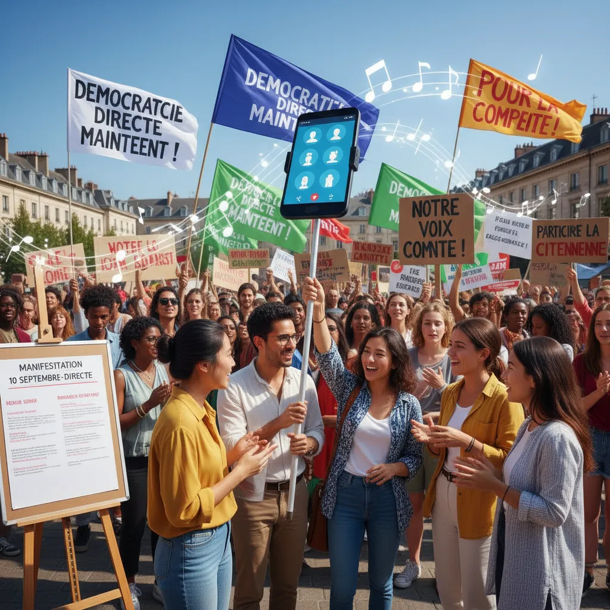

# 10 septembre : La démocratie directe à l'épreuve ✊  

  <title>Manifestation du 10 septembre et démocratie directe ✊</title>

<h1>Manifestation du 10 septembre et démocratie directe 🪧</h1>

Le 10 septembre, des milliers de manifestants ont défilé dans les rues pour exprimer leur mécontentement et réclamer une plus grande participation citoyenne.  Cette manifestation a mis en lumière un enjeu crucial : la démocratie directe 🗣️.

<ul>
  <li>
    <h2>Qu'est-ce que la démocratie directe ? 🤔</h2>
    
La démocratie directe, aussi appelée démocratie participative, est un système politique où les citoyens prennent part aux décisions collectives de manière plus directe. Selon cette conception de la démocratie, les citoyens peuvent voter directement sur des lois, des projets et des politiques publiques, plutôt que de déléguer le pouvoir à des représentants élus. 🗳️

  </li>
  <li>
    <h2>Les arguments en faveur de la démocratie directe 🤔</h2>
    
Les partisans de la démocratie directe soutiennent que cette forme d'organisation politique permet de : 

    <ul>
      <li>Renforcer la participation citoyenne et la responsabilisation des dirigeants. 🕴️</li>
      <li>Favoriser un dialogue plus transparent et ouvert entre les citoyens et l'État. 🗣️</li>
      <li>Offrir une meilleure représentation des volontés populaires.  👥</li>
    </ul>
  </li>
  <li>
    <h2>Les critiques de la démocratie directe ⚠️</h2>
    
La démocratie directe est également critiquée pour : 

    <ul>
      <li>Le risque d'être influencée par des campagnes de désinformation et des opinions de minorités. 📢</li>
      <li>La difficulté de traiter des questions complexes qui nécessitent une expertise spécialisée. 📚</li>
      <li>Le risque de polarisation et d'instabilité politique. 💥</li>
    </ul>
  </li>
  <li>
    <h2>La manifestation du 10 septembre : un appel à l'action ? 📣</h2>
    
La manifestation du 10 septembre a montré la vivacité du débat sur la démocratie en France. Quelles solutions concrètes peuvent être imaginées pour renforcer la participation citoyenne et rendre la démocratie plus inclusive ?  

  </li>
</ul>

        