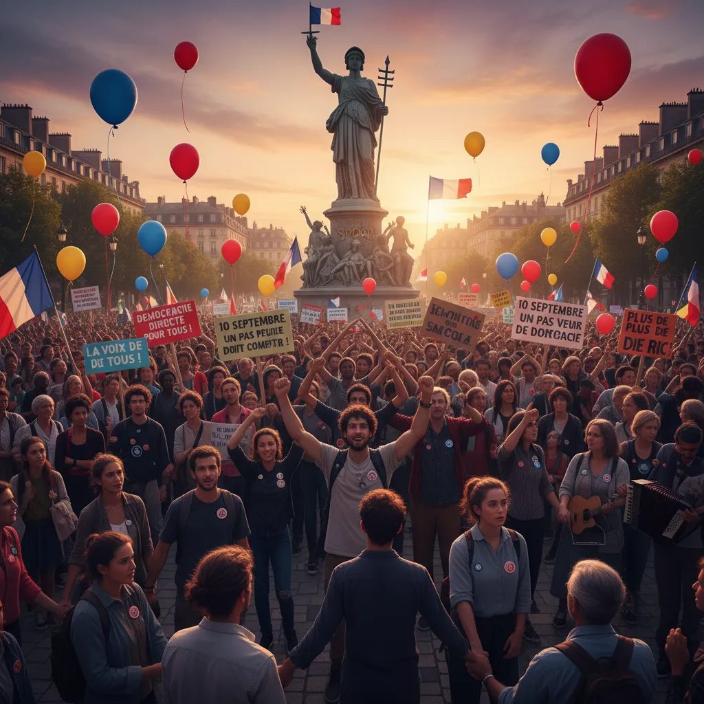

# 10 Septembre : Démocratie Direct ✊   

  <title>Manifestation du 10 septembre et démocratie directe ✊📢</title>

<h1>Manifestation du 10 septembre et démocratie directe ✊📢</h1>

Le 10 septembre a vu se dérouler une grande manifestation dans notre ville, mobilisant de nombreux citoyens soucieux du présent et de l'avenir de notre démocratie. Les manifestants étaient de toutes sortes, unis par un désir commun: qu'une démarche plus directe de participation citoyenne soit mise en place.

<ol>
  <li>
    <h2>Le poids du vote : une réalité limitée 😥</h2>
    
Nombreux sont ceux qui estiment que le système électoral actuel ne reflète pas toujours fidèlement la volonté majoritaire de la population. Le vote, bien que fondamental, peut avoir des limites lorsque des problèmes complexes soulèvent des questions pour lesquels ne manque pas de nuances et de perspectives diverses. 😄💭

  </li>
  <li>
    <h2>La démocratie directe : une alternative réelle ? 🤔</h2>
    
Face à cette réalité, l'idée de la démocratie directe gagne en popularité.  Si elle permet de donner aux citoyens un pouvoir décisionnel plus important et plus direct sur les sujets qui les concernent, elle soulève aussi des questions cruciales. ⚖️

    <ul>
      <li>
        
<b>Quels sont les sujets pertinents pour une décision directe ?</b>
        

      </li>
      <li>
        
<b>Comment éviter la manipulation et l'influence excessive des lobbies ?</b>
        

      </li>
      <li>
        
<b>Comment garantir une participation citoyenne équitable et inclusive ?</b> 

      </li>
    </ul>
  </li>
  <li>
    <h2>Le dialogue et la construction de consensus 🤝</h2>
    
La manifestation du 10 septembre a montré que le débat démocratique est nécessaire pour trouver des solutions adaptées à nos enjeux :  combattre le désenchantement démocratique et cultiver la participation citoyenne en construisant un dialogue serein et respectueux, ouvert à la diversité des points de vue. 🙏

  </li>
</ol>

        