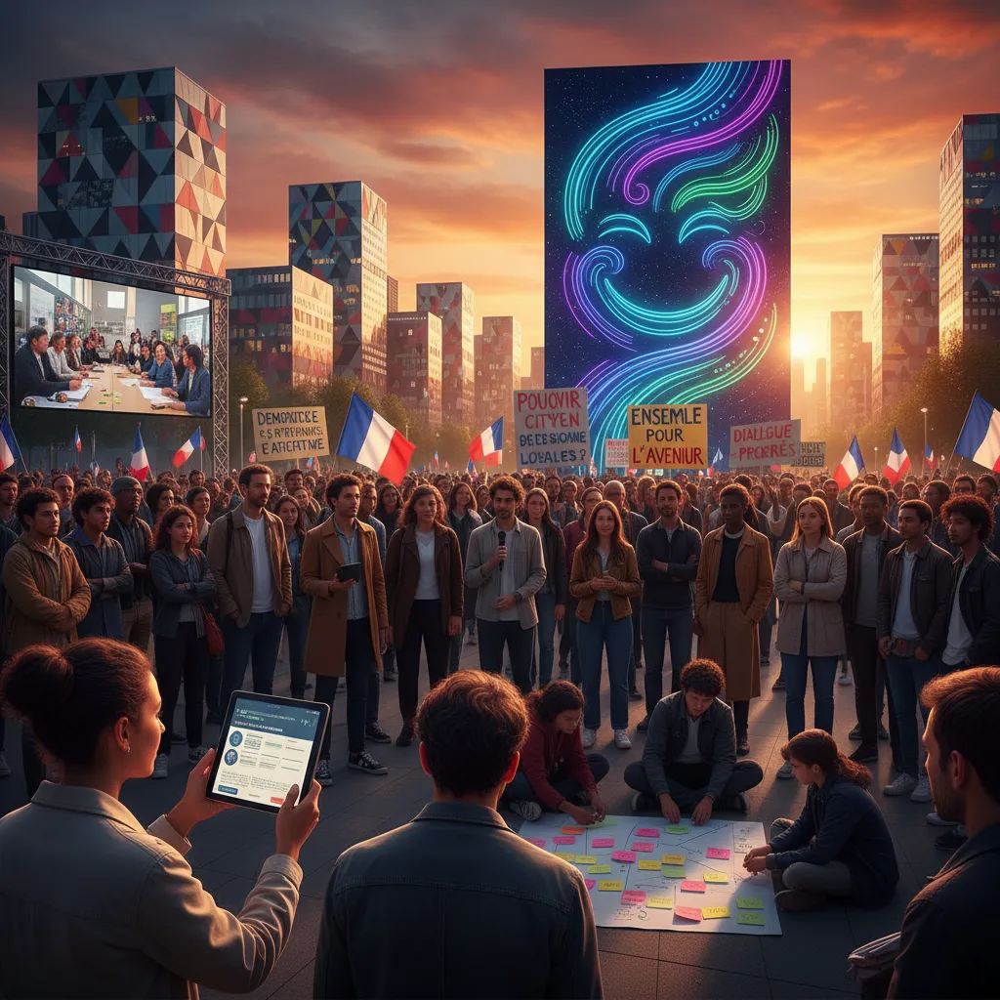

# 10 septembre : Un pas vers la démocratie ? 🤔  

  <h1>Manifestation du 10 septembre et démocratie participative  🗳️✊</h1>

<ul>
  <li>
    <h2>La Marche pour la Démocratie du 10 septembre : Un appel à la participation citoyenne 📢</h2>
    
Le 10 septembre dernier, des milliers de citoyens français ont défilé dans les rues de Paris et d'autres villes du pays, participant à la "Marche pour la Démocratie".  Cet événement a mis en lumière un sentiment profond d'inquiétude face aux défis démocratiques actuels et  l'envie de davantage de participation citoyenne dans la vie politique. 🏛️

  </li>
  <li>
    <h2>La démocratie participative : Qu'est-ce que c'est ? 🤔</h2>
    
La démocratie participative vise à donner aux citoyens un rôle plus actif dans la prise de décisions qui les concernent. Cela peut prendre différentes formes,  comme les consultations publiques, les référendums, l'initiative populaire, etc.  En bref, il s'agit d'aller plus loin que la simple « démocratie représentative » où les citoyens élisent des représentants pour prendre des décisions en leur nom. 

  </li>
  <li>
    <h2>Pourquoi la participation citoyenne est-elle si importante ? 💪</h2>
    <ul>
      <li>Elle permet de renforcer la confiance entre les citoyens et les institutions. 🤝</li>
      <li>Elle garantit que les décisions prises reflètent les besoins et les aspirations du peuple. 👥</li>
      <li>Elle favorise l'esprit citoyen et la responsabilisation des individus. 🤔</li>
    </ul>
  </li>
  <li>
    <h2>Les défis de la démocratie participative 🚧</h2>
    
Bien que la démocratie participative présente de nombreux avantages, elle soulève également des défis. L’un des plus importants est celui de garantir que tous les citoyens aient une voix égale et puissent participer efficacement, quelle que soit leur situation, leur âge, leur niveau de revenu, etc.  ⚖️

  </li>
  <li>
    <h2>Le 10 septembre : Un appel à l'action 👊</h2>
    
La manifestation du 10 septembre est un signe que les Français sont prêts à défendre leur démocratie et à réclamer une plus grande participation citoyenne. Il est important que les institutions écoutent cet appel et prennent des mesures concrètes pour améliorer la démocratie française. 🇫🇷

  </li>
</ul>

        