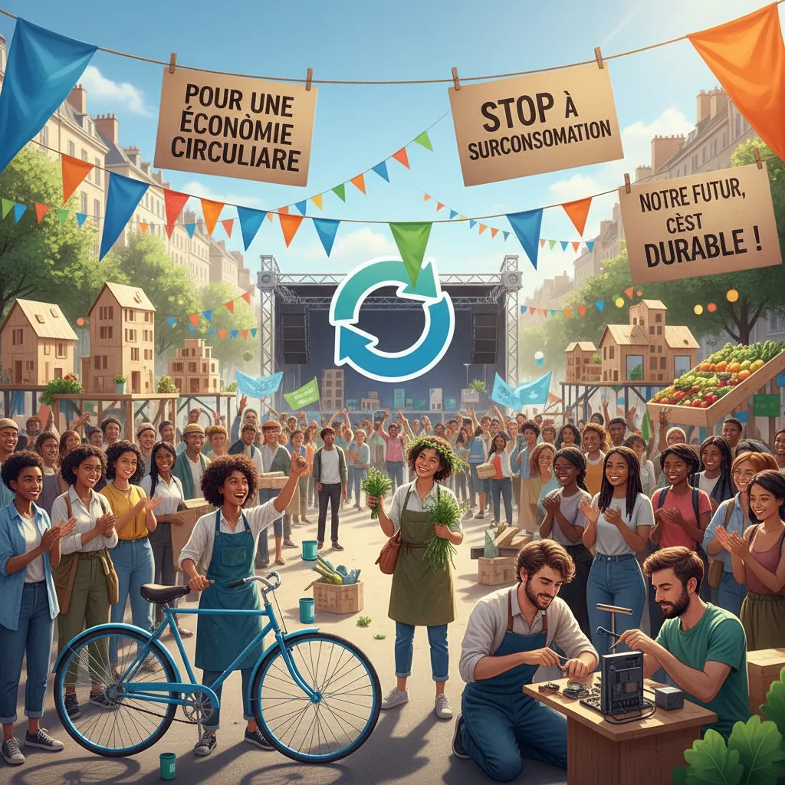

# 10 septembre : ✊ Economie circulaire, l'avenir au rendez-vous ? 🌎  

<article>
  <h1>Manifestation du 10 septembre et économie circulaire : un lien indéniable  🌳💰</h1>

  
Le 10 septembre dernier, des milliers de personnes se sont rassemblées à travers le monde pour manifester pour le climat 🌍.  Ces mobilisations citoyennes montrent une prise de conscience croissante de l'urgence climatique et de la nécessité de changer nos modèles économiques vers des alternatives durables. 🤯  L'économie circulaire se présente alors comme une réponse concrète à ce défi.

  <ul>
    <li>
      <h2>Pourquoi l'économie circulaire ?</h2>
      
L'économie linéaire, basée sur la production en masse suivie de l'élimination des déchets, est à l'origine des problèmes environnementaux auxquels nous sommes confrontés aujourd'hui ♻️. L'économie circulaire, en revanche, privilégie la réutilisation, le recyclage et la réduction des déchets pour minimiser l'impact environnemental 🌱.

    </li>
    <li>
      <h2>Le lien entre les manifestations et l'économie circulaire</h2>
      
Les manifestants du 10 septembre réclament des changements concrets pour lutter contre le changement climatique.  L'économie circulaire représente une solution concrète et faisable qui peut contribuer à réduire notre empreinte écologique 🤝.

    </li>
    <li>
      <h2>Comment l'économie circulaire peut transformer nos modes de vie</h2>
      <ul>
        <li>Consommer moins et mieux 🛍️:</li>
        <ul>
          <li>Privilégier les produits durables et réparables</li>
          <li>Adopter le "slow fashion" et l'achat d'occasion</li>
        </ul>
        <li>Réduire nos déchets 🗑️:</li>
        <ul>
          <li>Composter nos déchets organiques</li>
          <li>Utiliser des contenants réutilisables</li>
          <li>Réduire les emballages excessifs</li>
        </ul>
        <li>Valoriser les produits et matériaux en fin de vie ♻️:</li>
        <ul>
          <li>Recycler</li>
          <li>Donner une seconde vie aux objets</li>
          <li>Participer à des initiatives de remanufacture et de upcycling</li>
        </ul>
      </ul>
    </li>
  </ul>

  
L'économie circulaire est une alternative prometteuse qui peut nous aider à sortir du paradigme linéaire et à construire un avenir plus durable 🥂. Les manifestations du 10 septembre nous rappellent l'urgence de l'action.  Il est temps de passer de la parole aux actes et de soutenir les initiatives qui promouvent l'économie circulaire ! 🚀

</article>

 

        