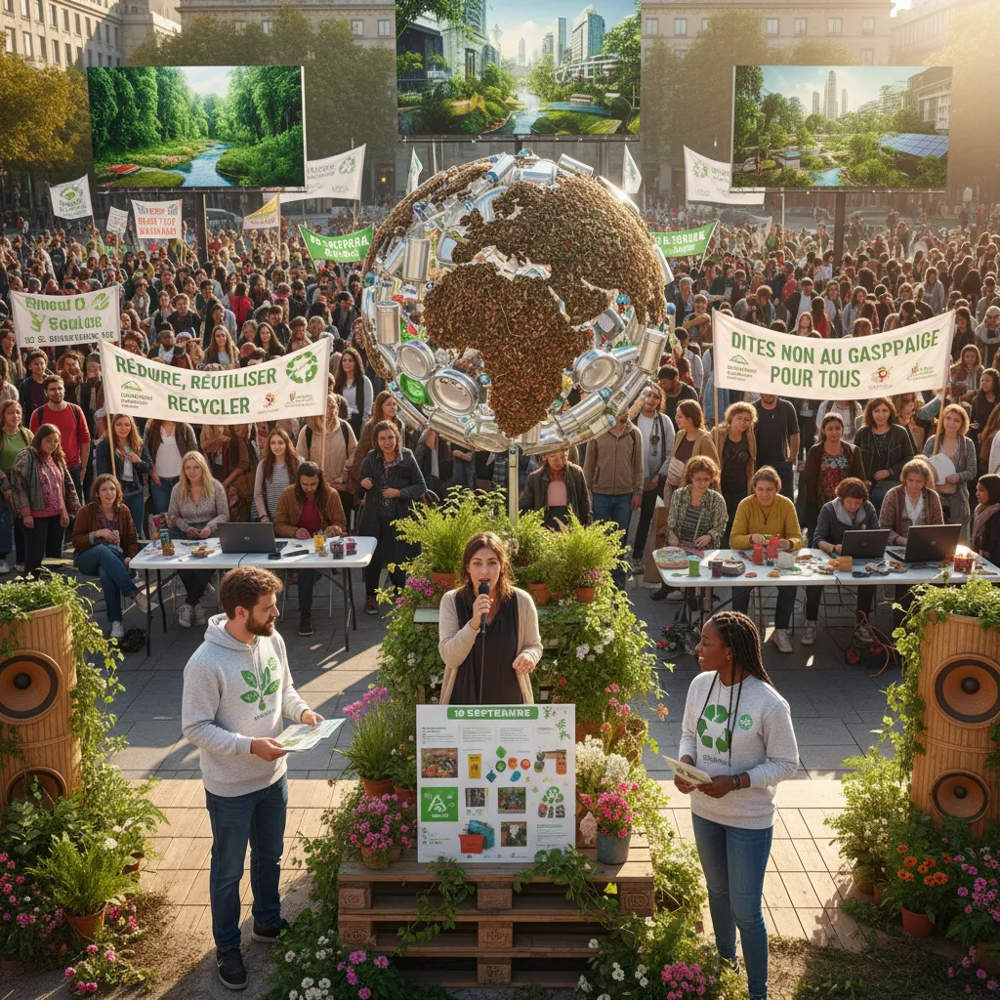

# Manifestation 10/09: L'économie circulaire en marche 🚀 

<h1>Manifestation du 10 septembre et économie circulaire : un lien à explorer ♻️</h1>

Le 10 septembre dernier, des manifestants ont défilé dans les rues pour protester contre la crise climatique et réclamer une action plus forte de la part des pouvoirs publics 📢. 

Cette mobilisation sociale soulève des questions importantes sur l'impact de nos modes de vie sur l'environnement 🌎 et la nécessité de repenser nos systèmes économiques  💡. Une notion qui trouve son expression dans le concept d'économie circulaire 🌀.

<ul>
  <li>
    <h2>L'impact des modes de vie sur l'environnement 🚯</h2>
    
La consommation massive, le gaspillage et la production intensive sont des facteurs aggravants de la crise climatique 🌡️. De nombreuses voix s'élèvent pour alerter sur les conséquences de nos habitudes consumistes et nous interpeller sur nos responsabilités 😥.

  </li>
  <li>
    <h2>L'économie circulaire comme solution 🌱</h2>
    
L'économie circulaire propose un modèle économique plus durable et responsable, basé sur l'utilisation rationnelle des ressources et la réduction des déchets 🧰. Elle encourage le réemploi, la réparation, le recyclage et la valorisation des produits au bout de leur cycle de vie 🔁.

  </li>
  <li>
    <h2>Le rôle des citoyens dans la transition 🤝</h2>
    
Les citoyens peuvent jouer un rôle actif dans cette transition vers une économie circulaire en adoptant des comportements plus responsables : privilégier l'achat d'articles durables, réparer plutôt que jeter, choisir des produits en matériaux recyclés 📦, participer aux initiatives locales de troc et de réparation, etc. 

  </li>
</ul>

Les actions engagées lors de la manifestation du 10 septembre sont un signal fort, une invitation à s'engager collectivement pour un avenir plus durable ✊. L'économie circulaire représente une voie prometteuse pour répondre aux défis écologiques et économiques de notre époque, et son adoption repose sur la coopération entre les citoyens, les entreprises et les pouvoirs publics 🌎💡🤖. 

        