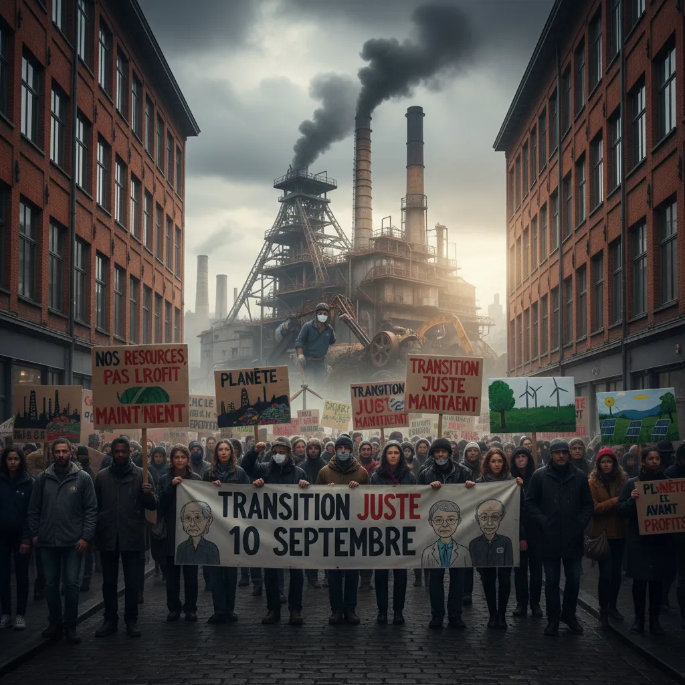

# Ressources : la manifestation du 10 septembre  ✊ 

  <title>Manifestation du 10 Septembre et l'Industrie des Ressources</title>

  <h1>Manifestation du 10 Septembre et l'Industrie des Ressources</h1>

  
La manifestation du 10 septembre a mis en lumière les préoccupations grandissantes concernant l'industrie des ressources et son impact sur l'environnement et la société.

  <ul>
    <li>
      <h3> L'extraction intensive ⛏️</h3>
      
Les manifestants dénoncent l'extraction intensive des ressources naturelles, qui appauvrit les sols, pollue les eaux et entraîne une perte de biodiversité. 

    </li>
    <li>
      <h3> Le changement climatique 🌡️</h3>
      
L'industrie des ressources est un important contributeur aux émissions de gaz à effet de serre, exacerbant le changement climatique. La manifestation a mis en évidence l'urgence de solutions durables. 

    </li>
    <li>
      <h3> Les impacts sociaux 👥</h3>
      
Des violations des droits humains et des injustices sociales sont souvent associées à l'exploitation des ressources. La manifestation a exprimé son soutien aux communautés locales affectées par les activités extractives.

    </li>
  </ul>

  
La manifestation du 10 septembre a démontré que l'industrie des ressources est à un carrefour. Des changements majeurs sont nécessaires pour garantir un avenir plus durable et équitable. 

        