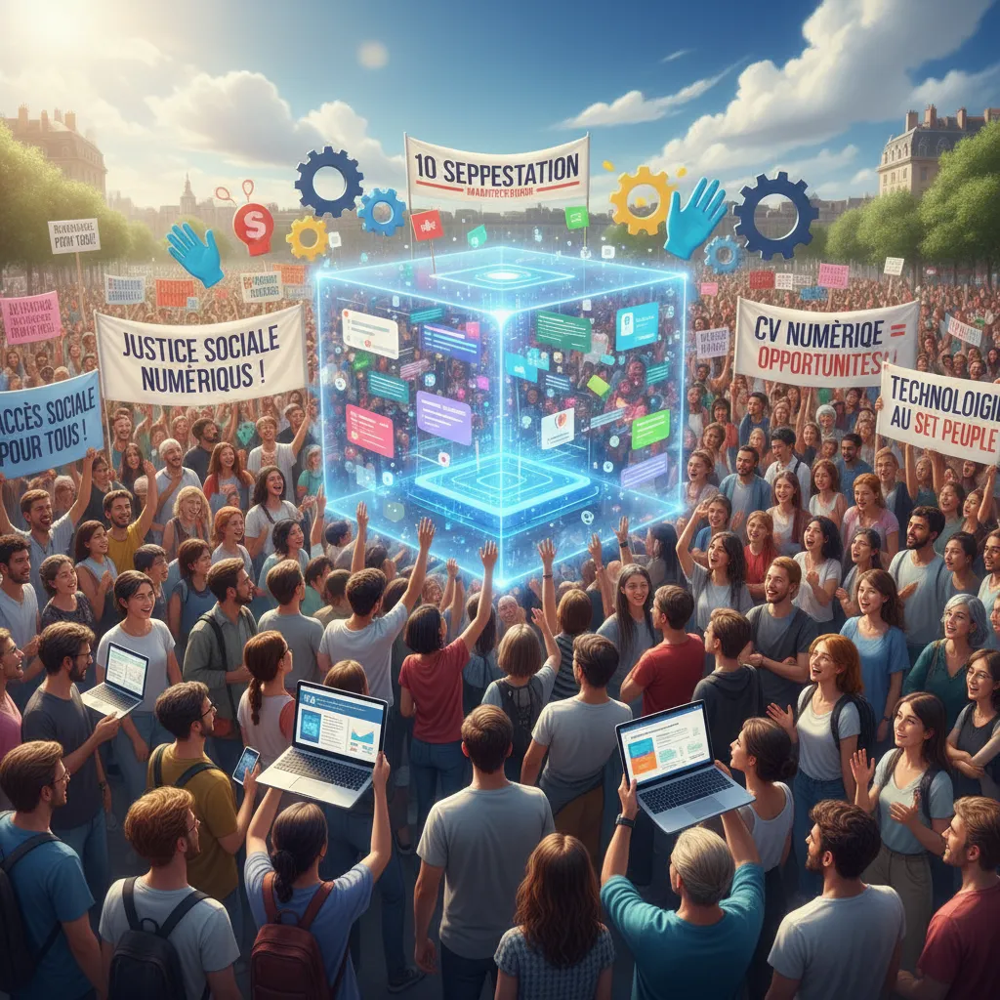

# RFR & Reveue Universel: 10 Sep.  ✊  

## Manifestation du 10 septembre : Revenu Universel et CV Numérique 💼 🌎 

<ul>
  <li>
    <h3>La manifestation du 10 septembre : un cri pour l'avenir ?</h3>
    
Le 10 septembre dernier, des milliers de personnes ont manifesté dans les rues de plusieurs villes 🚶‍♀️🚶‍♂️, mobilisés pour réclamer une réforme profonde de l'économie et des systèmes sociaux. Parmi les revendications phares, le revenu universel ✨ et la mise en place d'un CV numérique 💻 ont pris une place importante.

  </li>
  <li>
    <h3>Le Revenu Universel : une réponse aux inégalités ?</h3>
    
Le revenu universel, promesse d'un revenu minimum garanti à chaque citoyen, est perçu par certains comme une solution concrète aux inégalités croissantes 📈.  Abolissant l'enfermement dans precarité 💖, il permettrait de garantir à chacun un niveau de vie décent et de favoriser l'autonomie et l'entrepreneuriat 💡.

  </li>
  <li>
    <h3>Le CV Numérique : une révolution pour l'emploi ?</h3>
    
Un CV numérique, accessible et sécurisé 🔐, permettrait de centraliser les expériences professionnelles et les compétences de chaque individu 💪. Cette initiative promet d'optimiser le processus de recrutement et d'ouvrir de nouvelles portes dans le monde du travail 🌐.

  </li>
  <li>
    <h3>L'enjeu des nouvelles technologies :</h3>
    
Ces deux propositions, 🧠 soutenues par l'essor des nouvelles technologies, posent des questions cruciales sur l'avenir du travail et les systèmes sociaux. Il est crucial d'envisager de manière collective leurs impacts potentiels 🤝,  pour construire un avenir plus juste et durable 💛.

  </li>
</ul> 

        