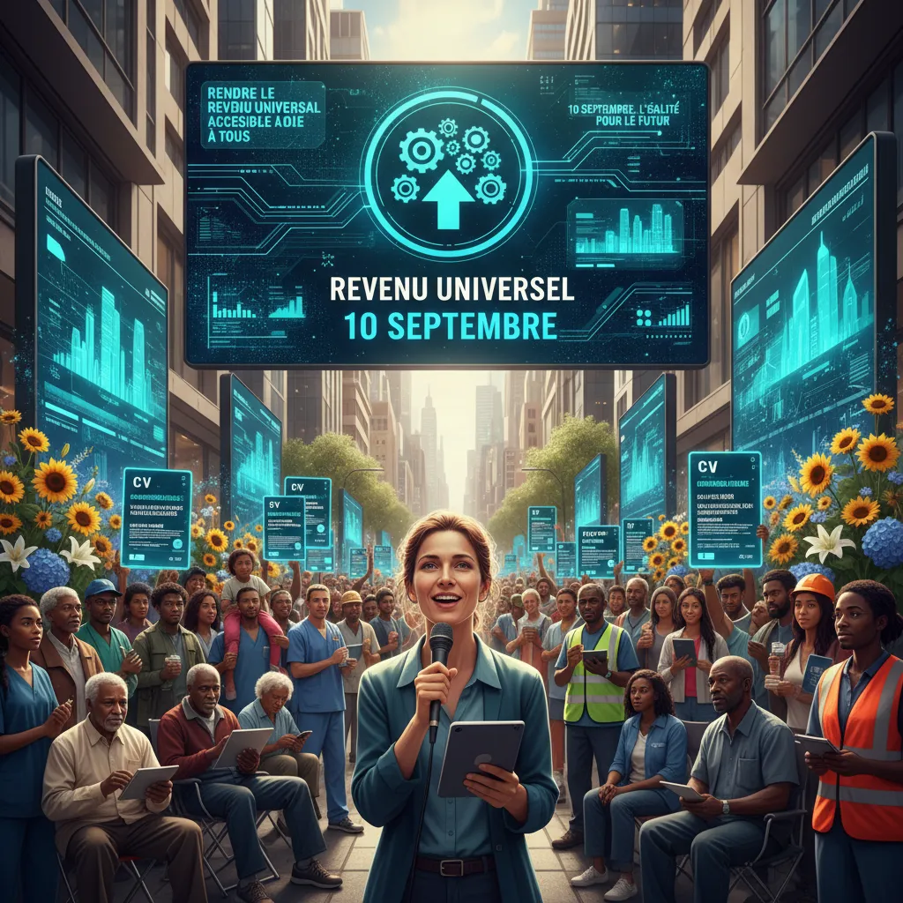

# 🔥 10 septembre : R.U. & CV numérique en mouvement ? ✊ 

  <meta charset="UTF-8">
  <title>Manifestation du 10 Septembre et Revenu Universel : Le CV Numérique enjeu clé?</title>

<h1>Manifestation du 10 Septembre et Revenu Universel : Le CV Numérique enjeu clé? </h1>

Le 10 septembre, de nombreuses manifestations autour du revenu universel se sont tenues à travers la France 🇫🇷. Cette initiative témoigne d'un besoin croissant de réinventer notre modèle économique face aux défis du XXIe siècle. Parmi les enjeux clés restant sur la table, le CV numérique se présente comme un outil précieux pour améliorer l'inclusion et l'adaptabilité du marché du travail dans un contexte de transformation digitale.

<ol type="1" style="list-style-style:disc;">
  <li>
      <h3>Le contexte : 🌎 Le coût de la vie en hausse et l'automatisation des métiers 🤖</h3>
      
L'inflation galopante et le chômage technique alimentent les craintes face à une évolution économique perturbatrice. Le revenu universel suscite l'attention comme une solution possible pour garantir un revenu minimum à tous et lutter contre l'exclusion sociale. 
      

  </li>
  <li>
      <h3>Le CV numérique : 💾 Une solution pour s'adapter au marché du travail fluide 🌐</h3>
      
Le CV numérique représente un outil essentiel pour accompagner les travailleurs vers une nouvelle ère de flexibilités&nbsp;; il permet de mettre en valeur leurs compétences et expériences  professions. L'accessibilité et la portabilité des données s'inscrivent dans une volonté d'ouverture et de simplification des processus de recrutement et de formation.  
      

  </li>
  <li>
      <h3>Enjeux interdépendants : 🧬  Revenu universel et CV numérique - un duo gagnant ?</h3>
      
L'alliance du revenu universel et du CV numérique peut créer un écosystème inclusif et dynamisant. Le revenu universel permet de sécuriser les fondements de l'existence, tandis que le CV numérique offre les moyens d'acquisition et de développement de compétences pour s'insérer dans les dynamiques économiques futures.  
      

  </li>
</ol>

Il est essentiel de poursuivre le dialogue et l'action pour faire avancer ces deux enjeux cruciaux qui peuvent contribuer à bâtir un avenir plus juste et plus prospère pour tous.

        