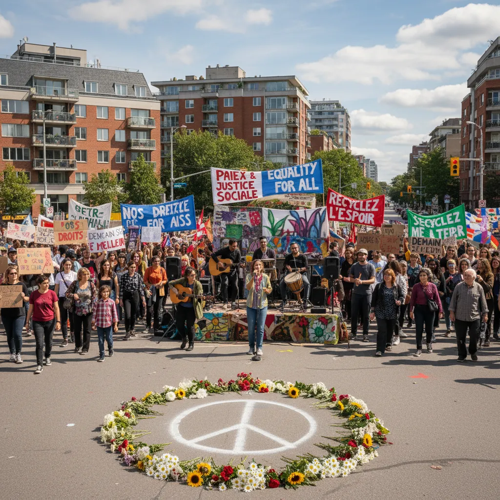

# Manifestation 10/Septembre : Cri de Rond-Point 📢   

<article>
  <h1>Manifestation du 10 septembre rond rond-point: Un cri contre le changement climatique 🌎🔥</h1>

  
Un rassemblement important s'est déroulé le 10 septembre sur le rond-point [Nom du rond-point], réunissant des citoyens de tous âges et horizons pour exprimer leur inquiétude face à la crise climatique 

  
  <h2>Les motivations de la manifestation 🗣️🤝</h2>

  *  <ul>
      <li>Démocratiser l'accès à l'information sur le changement climatique 📊</li>
      <li>Exiger des mesures concrètes pour réduire les émissions de gaz à effet de serre 🚦</li>
      <li>Défendre la protection de la biodiversité et des écosystèmes 🌳🐕‍🦺</li>
    </ul>

  <h2>Un jour de mobilisation citoyenne ✊🏽🌟</h2>

  
 Des dizaines de personnes ont pris part à la manifestation, arborant des pancartes et des slogans engagés. L'ambiance était festive et solidaire, malgré la gravité du sujet abordé. Des groupes de jeunes éco-responsables ont animé des ateliers éducatifs pour sensibiliser le public aux enjeux du changement climatique 🤓📚 

  <h2>Un appel à l'action collective  🌍📣</h2>

  
La manifestation du 10 septembre rond-point a démontré la prise de conscience croissante de la population face aux défis du changement climatique. Les organisateurs appellent à la continuité de la mobilisation citoyenne pour influencer les décisions politiques et construire un avenir plus durable pour tous 🏘️♻️

</article>

        